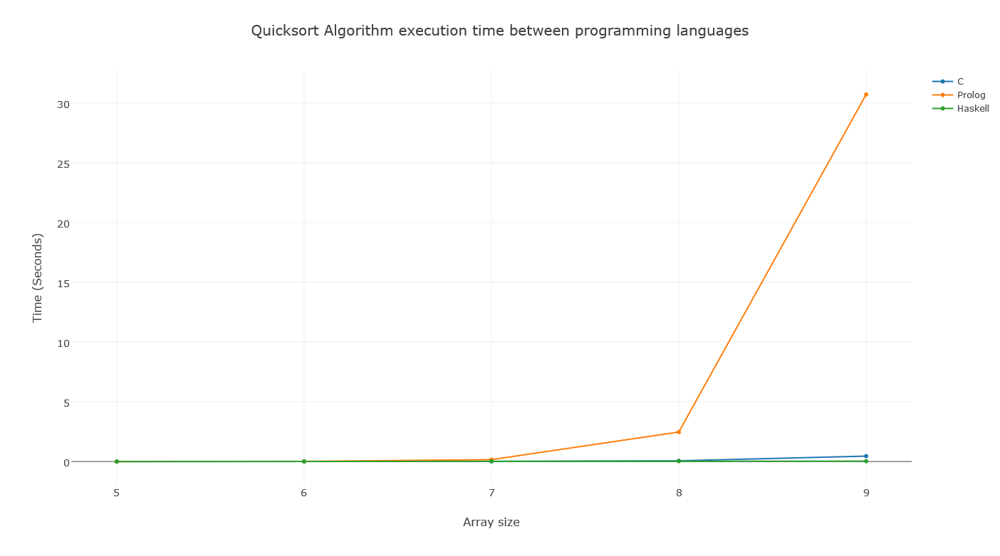

# HaskellQuicksort
This projet aims to compare execution time of quicksort algorithm between C, Haskell and Prolog implementations.

# Compiling
gcc -o permutation permutation.c

gcc -o quick quicksortN.c (N = array size)

# Instructions
1.  Define the array size at permutation.c (line 4) and then run the permutation.c (./permutation);
2.  Run:
  1. C: Compile quicksortN.c and run ./quick; (N = array size)
  2. Prolog: Open quicksortN.pl and query the clause "check" (N = array size);
  3. Haskell: Open quicksortN.hs and then run function "main" (N = array size).

# Results

Analitic result:

Execution time for different amounts of elements in array

| Language | 5 | 6 | 7 | 8 | 9 |
|-----------|-----------|-----------|-----------|-----------|-----------|
|C	| 0,000000 s	| 0,000000 s	| 0,015000 s	| 0,062000 s |	0,453000 s|
|Prolog	| 0,000000 s |	0,015000 s |	0,160000 s |	2,468000 s |	30,708* s|
|Haskell	| 0,0000000 s	| 0,015701 s |	0,024324 s	| 0,030638 s	| 0,030791 s|

* Note: Time meansure generated by the average execution time of samples with 40.320 (8!) elements from permutation_n9.txt file.

  
